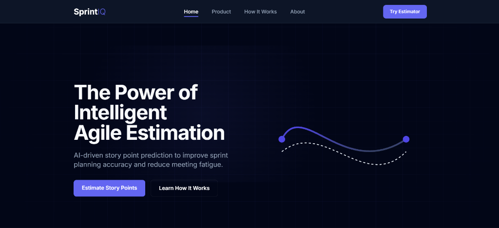
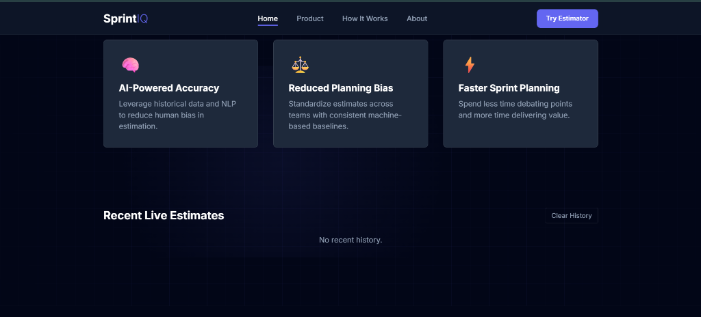
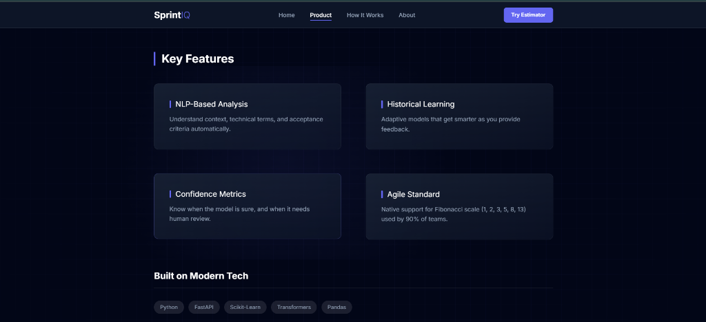
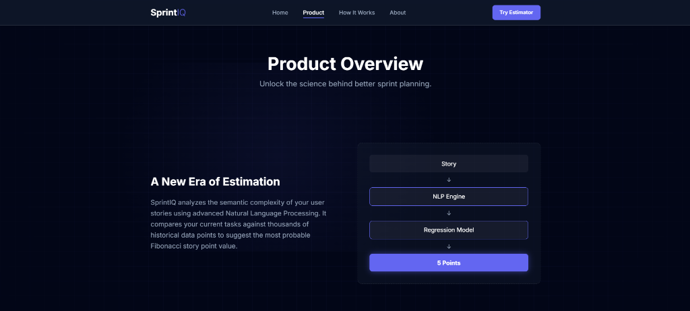
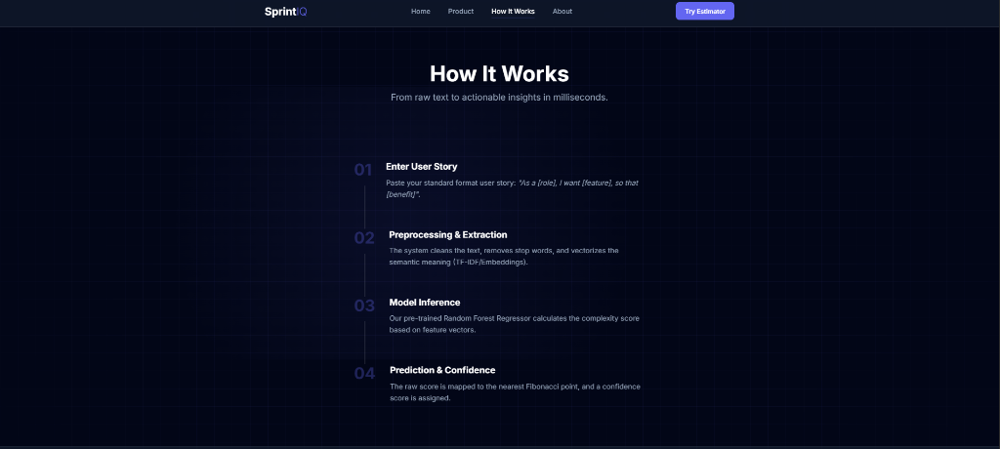
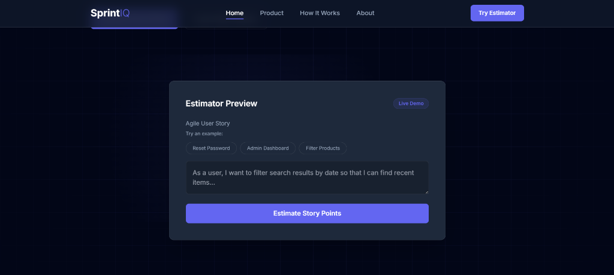
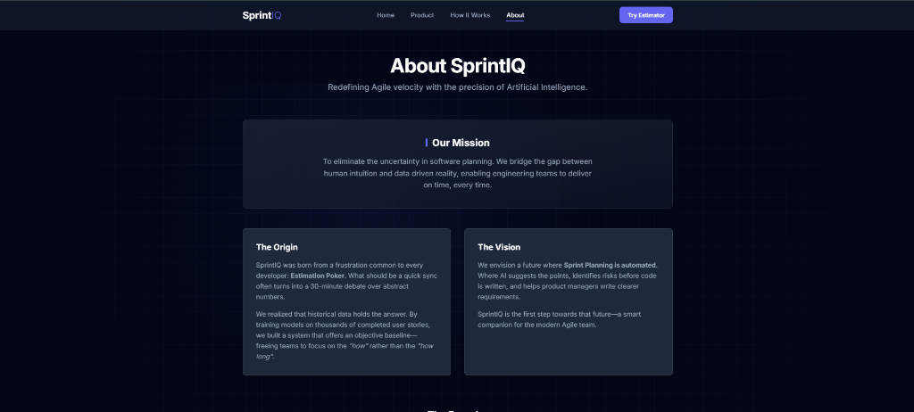

# SprintIQ: Intelligent Agile Estimation System



## Introduction

SprintIQ is an advanced, machine learning-based estimation system designed to optimize Agile sprint planning processes. By leveraging Natural Language Processing (NLP) and historical project data, SprintIQ analyzes the semantic complexity of user stories to provide objective, data-driven story point estimates. This system aims to eliminate the subjective bias inherent in traditional estimation methods, such as planning poker, and significantly reduce the time engineering teams spend on sprint planning.

## Project Overview

In modern software engineering, accurate estimation is critical for predictable delivery and effective resource allocation. However, human estimation is often prone to cognitive biases, fatigue, and inconsistency. SprintIQ addresses these challenges by introducing an objective, automated baseline for estimation.

The platform bridges the gap between human intuition and statistical reality. By training on a comprehensive dataset of completed user stories and their actual implementation complexities, SprintIQ learns to recognize patterns in requirements that correlate with higher or lower effort levels. This results in estimates that are consistent, reproducible, and grounded in empirical data.



## Key Features

### Artificial Intelligence-Powered Accuracy
SprintIQ utilizes a sophisticated regression model trained on historical agile data. Unlike simple rule-based systems, it understands the nuance of technical requirements. By continuously analyzing new data, the model's accuracy improves over time, adapting to the specific vocabulary and complexity patterns of the development team.

### Mitigation of Planning Bias
Human estimation is often influenced by social dynamics, seniority, or optimism bias. SprintIQ provides a neutral, algorithmic second opinion. This standardization helps teams converge on realistic estimates faster and ensures that story points remain consistent across different sprints and projects.

### Efficiency in Sprint Planning
The traditional estimation process can be time-consuming, often descending into lengthy debates over abstract numbers. SprintIQ provides immediate estimates, allowing teams to focus their discussion on implementation details and architectural risks rather than numerical negotiation.

### Confidence Metrics and Risk Assessment
The system does not just provide a raw number; it also calculates a confidence score for each prediction. This allows teams to identify which stories are well-understood by the model and which may require deeper human review due to ambiguity or novelty.



### Standard Agile Methodology Compliance
The system is designed to integrate seamlessly into existing Agile workflows. It natively supports the Fibonacci sequence (1, 2, 3, 5, 8, 13) for story points, the standard scale used by the majority of Agile teams to represent exponential complexity.

## System Architecture and Workflow

SprintIQ operates through a four-stage pipeline that transforms raw text into actionable insights.



### 1. Data Input
The process begins with the input of a user story, typically following the standard format: *"As a [role], I want [feature], so that [benefit]"*. The system accepts this unstructured text via a web interface or a RESTful API.

### 2. Preprocessing and Feature Extraction
Upon receipt, the raw text undergoes rigorous preprocessing. This includes:
*   **Tokenization**: Breaking text into individual semantic units.
*   **Stop-word Removal**: Filtering out common words that contribute little semantic value.
*   **Vectorization**: Converting text into numerical feature vectors using techniques such as TF-IDF (Term Frequency-Inverse Document Frequency) or word embeddings. This captures the semantic weight of technical terms and action verbs.



### 3. Model Inference
The vectorized data is passed to a pre-trained Machine Learning model, specifically a Random Forest Regressor. This ensemble learning method is effective for capturing non-linear relationships between linguistic features and implementation effort. The model calculates a raw continuous complexity score based on the learned decision trees.

### 4. Prediction and Fibonacci Mapping
The raw complexity score is mapped to the nearest value in the standard Agile Fibonacci scale. Simultaneously, a confidence score is generated based on the variance of the decision trees in the forest, providing the user with context regarding the reliability of the estimate.

## Technology Stack

The SprintIQ platform is built upon a robust, modern technology stack designed for performance, scalability, and maintainability.

*   **Backend Framework**: FastAPI (Python) - Chosen for its high performance, native asynchronous support, and automatic API documentation generation.
*   **Machine Learning**: Scikit-Learn - Utilized for model implementation, pipeline construction, and feature vectorization.
*   **Data Processing**: Pandas & NumPy - Employed for efficient data manipulation and numerical analysis during training and inference.
*   **Template Engine**: Jinja2 - Used for server-side rendering of the web interface.
*   **Server**: Uvicorn - A lightning-fast ASGI server implementation.

## Installation and Setup Guide

Follow these instructions to set up the SprintIQ development environment locally.

### Prerequisites
*   Python 3.9 or higher
*   pip (Python Package Installer)

### Step 1: Install Dependencies
Navigate to the project root directory and install the required Python packages.

```bash
pip install -r requirements.txt
```

### Step 2: Model Training
Before starting the application, the machine learning model must be trained. The training script processes the dataset, generates the vocabulary, and serializes the trained model and vectorizer to the `ml_artifacts/` directory.

```bash
python scripts/train_model.py
```

### Step 3: Application Startup
Launch the application server using Uvicorn. This will start both the API and the web interface.

```bash
uvicorn app.main:app --reload
```
Once the server is running, the application will be accessible at `http://127.0.0.1:8000`.

## Usage Instructions

### Web Interface
The SprintIQ web interface provides a user-friendly environment for estimation.



1.  Open a web browser and navigate to `http://127.0.0.1:8000`.
2.  Select the **Estimator** tab.
3.  Input the detailed user story into the provided text field.
4.  Execute the estimation to view the predicted story points and confidence level.

### API Integration
For integration with external tools (such as Jira or Trello), use the REST API endpoint.

**Endpoint**: `POST /predict`
**Content-Type**: `application/json`

**Request Payload**:
```json
{
  "user_story": "As a user, I want to filter search results by price range so that I can find affordable items."
}
```

**Response Payload**:
```json
{
  "predicted_story_points": 3,
  "model_used": "RandomForestRegressor",
  "confidence": "high"
}
```

## About the Project



### Mission Statement
The mission of SprintIQ is to eliminate uncertainty in software planning. We aim to bridge the gap between human intuition and data-driven reality, enabling engineering teams to deliver projects on time and with high predictability.

### Origin and Motivation
SprintIQ was developed to address the inefficiencies of "Estimation Poker"—a common Agile ceremony that often results in prolonged debates over abstract estimates. Recognizing that historical data contains valuable patterns, the project was initiated to create an objective baseline for complexity, allowing teams to focus on technical implementation rather than estimation debates.

### Future Vision
We envision a future where Sprint Planning is fully automated. In this future, AI systems will not only suggest story points but also identify potential implementation risks, suggest acceptance criteria, and help product managers refine requirements before a single line of code is written.

## Credits and Copyright


**Founder & Lead Developer**: Alla Rishi Venkatesh
*B.Tech Student & AI Developer*

> "Developed as a B.Tech project, SprintIQ demonstrates the power of Machine Learning in modern software engineering. This platform was built to demonstrate how data-driven insights can resolve real-world Agile challenges like estimation bias."

**Copyright © 2026 Alla Rishi Venkatesh. All Rights Reserved.**

This project, including its source code and proprietary estimation algorithms, is the intellectual property of Alla Rishi Venkatesh. Unauthorized reproduction, distribution, or commercial use of the core logic without explicit permission is strictly prohibited.
