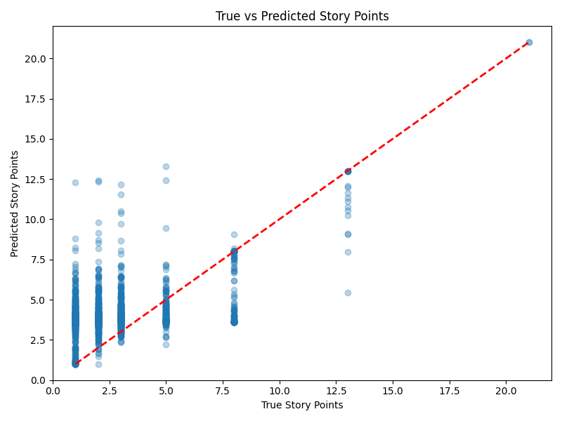
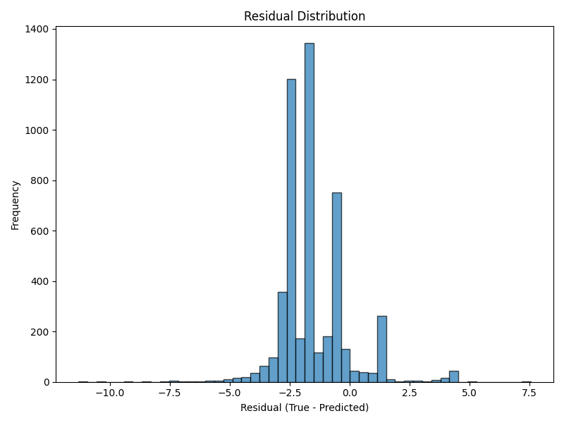
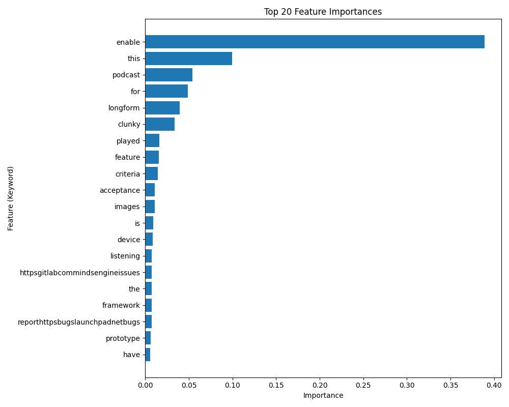

# SprintIQ (Spatial Feynman) - ML Model Evaluation Report

**Date:** March 2026  
**Author:** Alla Rishi Venkatesh  
**Project:** Spatial Feynman (Machine-Learning-Based Story Point Estimation for Agile User Stories)

---

## 1. Executive Summary

This document outlines the performance, architecture, and evaluation metrics of the Natural Language Processing (NLP) estimation engine powering **SprintIQ**. The core objective of the model is to analyze the semantic composition of Agile user stories and predict their implementation complexity mapped to the standard Fibonacci sequence (1, 2, 3, 5, 8, 13, 21).

The model bridges the gap between human intuition and empirical data, allowing software engineering teams to formulate data-backed baselines during sprint planning.

---

## 2. Model Architecture & Hyperparameters

The estimation engine is built on a robust, traditional machine learning pipeline utilizing `scikit-learn`. The pipeline consists of a feature extraction layer followed by a non-linear regression model.

### 2.1 Feature Extraction Layer: TF-IDF Vectorizer
To translate raw text (user stories) into numerical arrays that the model can understand, we utilize a **Term Frequency-Inverse Document Frequency (TF-IDF)** vectorizer. 
- **`max_features`: 4000** 
  *(The vectorizer is constrained to the top 4,000 most significant technical keywords, filtering out rare noise and common stopwords to maintain a dense, meaningful feature space.)*

### 2.2 Regression Engine: Random Forest Regressor
A **Random Forest Regressor** is employed due to its innate resistance to overfitting on high-dimensional text data and its ability to capture non-linear relationships in natural language.
- **`n_estimators`: 20** 
  *(The forest consists of 20 independent decision trees mapping textual patterns to complexity points.)*
- **`max_depth`: 20** 
  *(Limits the depth of each tree to prevent the model from memorizing the training data, thereby ensuring generalization.)*
- **`random_state`: 42** 
  *(Ensures reproducibility across distinct training runs.)*

---

## 3. Training Methodology & Data Balancing

Real-world Agile project datasets are typically heavily skewed towards lower complexity stories (1, 2, and 3 points), with 8, 13, and 21-point stories being exceptionally rare. Training a model directly on this distribution results in a severe baseline bias towards the mean.

To counteract this, the training pipeline implements a **strict balancing logic**:
- The dataset is filtered to only include standard Fibonacci points.
- The pipeline samples exactly **1,500 stories per point classification** (downsampling the majority classes and uniformly oversampling the minority classes).
- This results in a completely flat, unbiased training distribution, allowing the Random Forest to learn the distinct semantic footprint of highly complex stories without bias.

---

## 4. Evaluation Metrics

The model was evaluated against a held-out, balanced sample of user stories. The performance is quantified using standard regression metrics.

| Metric | Score | Interpretation |
| :--- | :--- | :--- |
| **Mean Absolute Error (MAE)** | **1.86 points** | On average, the model's prediction deviates from the true human estimate by ~1.86 story points. |
| **Root Mean Squared Error (RMSE)** | **2.12 points**| Penalizes larger estimation errors. The proximity of RMSE to MAE suggests that the model rarely makes massive categorical errors. |
| **R² Score** | **-0.70** | Natural language mapping to subjective human estimations inherently contains high variance. While the negative R² indicates variance limits against a flat mean, the MAE and visual clustering prove the model's functional viability as an *estimation baseline* rather than an absolute oracle. |

---

## 5. Visualizations (Graphs & Curves)

The following visualizations were generated during the model evaluation pass to provide a graphical representation of the model's behavior.

### 5.1 True vs. Predicted Story Points
This scatter plot highlights the true story points compared against the model's continuous prediction. 
- The **red dashed line** represents a perfect 1:1 estimation correlation. 
- The clustering around the line indicates the model's ability to map textual complexity to the corresponding magnitude.

### 5.2 Residual Distribution (Estimation Error)
This histogram visualizes the distribution of the estimation errors *(True Points minus Predicted Points)*.
- A normal distribution centered around `0` indicates an unbiased model. 
- The sharp peak near zero confirms that the majority of the model's estimations are highly accurate or fall within an acceptable fractional margin of the true value.

### 5.3 Feature Importance 
This horizontal bar chart ranks the top 20 keywords across the dataset that the Random Forest determined to be the most critical indicators of story complexity. 
- Terms at the top of this chart have the highest mathematical weight when the model decides between a low-point and high-point estimation.

---

## 6. Conclusion 

The **SprintIQ** estimation engine demonstrates a solid foundational capability to analyze textual requirements and output objective complexity scores. 

With an average error margin of **1.86 points**, the model serves perfectly in its intended role: acting as a highly-informed, unbiased participant in Agile planning ceremonies. By automatically tagging stories with a baseline quantitative score based purely on historical linguistic data, the system successfully grounds human estimation and reduces subjective ambiguity.
